# E2E Test Gap Implementation Plan

## Overview

16 beads items track implementation gaps found in the e2e test suite. The key insight: **most features already exist in the parser/AST but have dispatch or syntax gaps**. The work is mostly wiring, not greenfield implementation.

## Dependency Graph

```mermaid
graph TD
    A[camp-73v: Effect rows in type position] --> B[camp-2su: handle/intercept syntax]
    A --> C[camp-b48: Effect operation calls]
    A --> D[camp-4k1: Effectful ! suffix validation]
    E[camp-qc0: Trait/is declaration] --> F[camp-1vv: Record patterns in match]
    G[camp-rs9: Mutable $ syntax] --> H[camp-0xi: for loop syntax]
    I[camp-luw: // line comments] --> J[camp-d3g: Match arm syntax]
    K[camp-jpx: WASM type mismatch]
    L[camp-17c: Record return type]
    M[camp-pcq: Kitchen-sink SIGSEGV]
    N[camp-e1f: Multi-param lambda validation]
    O[camp-901: Paren call validation]
    P[camp-yut: Double ! validation]
```

## Phased Plan

### Phase 1: Effect Rows in Type Position (camp-73v)
**Unblocks: 14 e2e tests** (all effects, all scheduler, effectful-naming validation)

**Root cause**: `parser_parse_function_type` (line 1350) only supports `||` (zero-param) and `(...)` (multi-param). It does NOT support single-pipe `|ParamType|` syntax. This means `throw!: |I64| -[Throw!(I64)]-> I64` fails because the function type parser can't handle `|I64|`.

**Changes**:
1. In `parser_parse_function_type`: after consuming the first `.Pipe`, check if the next token is also `.Pipe` (zero-param `||`). If not, parse a single type between the pipes as the parameter type: `|I64|` → function type with one typed param.
2. After the `|...|` param, the `->` and `-[...]->` effect row syntax should already work (lines 1362-1380 handle this).
3. Verify that effect declaration syntax `Throw! : { throw!: |I64| -[Throw!(I64)]-> I64 }` parses correctly end-to-end.

**Files**: `src/frontend/parser.odin` (function type parsing ~line 1350-1388)

**Verification**: `effect-throw-handler`, `effect-declaration`, `effectful-function` e2e tests should move from syntax-error to either passing or hitting the next error (likely handle/intercept).

---

### Phase 2: Handle/Intercept Wiring (camp-2su)
**Unblocks: 14 e2e tests** (same set as Phase 1)

**Root cause**: `parser_parse_handle` (line 1022) and `parser_parse_prefix` routing for `.Kw_Handle`/`.Kw_Intercept` already exist. The e2e tests fail because of cascading errors from Phase 1, NOT because handle parsing is broken.

**Changes**:
1. Run `effect-throw-handler` e2e after Phase 1. If `handle Throw! in ... with { ... }` parses correctly, no code changes needed.
2. If handle still fails, investigate the specific error. Likely issues:
   - Handler arm syntax `.op!(resume, args) => body` — verify the `.` prefix on operation names is handled
   - `resume` keyword handling in handler arms
3. Add `parser_parse_intercept` if it doesn't exist (check if it shares code with handle).

**Files**: `src/frontend/parser.odin` (handle parsing ~line 1022-1080)

**Verification**: `effect-throw-handler`, `handle-expression` e2e tests should parse correctly.

---

### Phase 3: Effect Operation Calls (camp-b48)
**Unblocks: 3+ e2e tests**

**Root cause**: `IO!.println!("hi")` — `IO!` is already parsed as `Upper_Id` (lexer absorbs `!` into identifier text at line 363). Then `.println!` is parsed as method chain. The `!` is part of the method name. This should already parse as `Method_Call`. The e2e failures are likely cascading from Phase 1.

**Changes**:
1. After Phase 1+2, run `perform-call`, `unhandled-effect`, `unhandled-console-effect` e2e tests.
2. If they still fail, the issue is likely in semantic analysis (typechecker doesn't know about effect operations) rather than parsing. Investigate and fix in `src/semantics/typecheck.odin` and `src/semantics/canonicalize.odin`.
3. May need to add effect operation resolution in `src/build/import_resolve.odin`.

**Files**: Potentially `src/semantics/typecheck.odin`, `src/semantics/canonicalize.odin`

**Verification**: `perform-call` e2e test should compile and run.

---

### Phase 4: Trait Declaration Dispatch (camp-qc0)
**Unblocks: 5 e2e tests**

**Root cause**: Two problems:
1. `Eq : { eq: |Self, Self| -> Bool }` — `Eq` is `Upper_Id`, next token is `:` not `is`, so `is_trait_decl` (line 1590) returns false. Falls through to `parser_parse_const_decl`. The `:` is consumed as type annotation separator, but the record-of-signatures type `{ eq: ... }` isn't handled properly.
2. `|Self, Self|` — lambda params don't accept `.Kw_Self` token (line 685 only checks `.Identifier || .Upper_Id`).

**Changes**:
1. In `parser_parse_lambda` (line 685): add `.Kw_Self` case to accepted lambda param tokens. `Self` should be treated as a type parameter, producing a `Pattern_Identifier` with name "Self" or a dedicated `Pattern_Self`.
2. In `parser_parse_decl` dispatch: when `Upper_Id` is followed by `:`, need to look further ahead to distinguish trait declarations (`Name : { method_sig, ... }`) from type aliases (`Name : Type`). Heuristic: if `:` is followed by `{` and the body contains function signatures (patterns with `Self` or `|` pipes), it's a trait. Alternatively, spec may define a clearer syntactic distinction.
3. `@UserId is Eq : U64` — `parser_parse_newtype_decl` (line 1602) already handles `@` + name + `is` + trait + `:` + underlying type. This should already work once cascading errors from line 1 are fixed.

**Files**: `src/frontend/parser.odin` (lambda params ~line 685, decl dispatch ~line 122-146)

**Verification**: `traits/basic` e2e test should parse. May still fail at typecheck if trait resolution isn't implemented.

---

### Phase 5: Record Patterns in Match (camp-1vv)
**Unblocks: 1 e2e test**

**Root cause**: Match parser at line 985 calls `parser_parse_pattern(p)` directly. When the first arm has leading `|` (like `| { x: a, y: b } => ...`), the `|` token is not consumed before pattern parsing. `parser_parse_pattern` doesn't handle `.Pipe`, so it falls to default → creates wildcard, consuming the `|`. Then `{ x: a, y: b }` is parsed as a record pattern. The wildcard + record pattern is wrong.

**Changes**:
1. In `parser_parse_match` (line 976-1020): after consuming the opening `.LBrace` of the match body, consume an optional leading `|` before the first arm. This is standard in ML-family languages.
2. `parser_parse_pattern` already handles `.LBrace` → `parser_parse_record_pattern` (line 1165-1166), so once the leading `|` is consumed, record patterns in match arms will work.

**Files**: `src/frontend/parser.odin` (match parsing ~line 976-1020)

**Verification**: `match-record-pattern` e2e test should parse correctly.

---

### Phase 6: Mutable $ and for Loop Wiring (camp-rs9, camp-0xi)
**Unblocks: 3 e2e tests**

**Root cause**: `Expr_Dollar_Identifier` (line 392) and `Expr_For` (line 420) already exist. `$count` in expression position works via `parser_parse_prefix`. `$count = expr` reassignment works via `parser_parse_statement` (line 857). The e2e test failures are likely cascading from effect operation calls (`Console.println!($count)`) which fail due to Phase 3 issues.

**Changes**:
1. After Phase 3, run `var-loop-exempt`, `var-loop-pure-unused`, `var-overwrite-before-read` e2e tests.
2. If they still fail, investigate the specific error. Likely issues:
   - `$count` in argument position to effect operation calls
   - `for` loop inside function body that also uses effects
3. If the issue is purely cascading, no new code needed. If there's a real gap in `$` handling, fix in parser.

**Files**: Potentially `src/frontend/parser.odin`

**Verification**: `var-loop-exempt` e2e test should compile and run.

---

### Phase 7: // Line Comments (camp-luw)
**Unblocks: 1 e2e test**

**Root cause**: Lexer only supports `--` comments (line 68). `//` is not recognized.

**Changes**:
1. In `lexer.odin` `lexer_lex_comment` (line 68): add `//` as a second comment prefix. When the lexer sees `//`, skip to end of line (same behavior as `--`).
2. In `lexer_lex_main`: after checking for `--`, also check for `//`.

**Files**: `src/frontend/lexer.odin`

**Verification**: `generic-list-map` e2e test should parse past the `//` comment.

---

### Phase 8: Match Arm Syntax (camp-d3g)
**Unblocks: 1 e2e test** (same as Phase 7)

**Root cause**: Current parser requires `| Pattern => body` with leading `|` on every arm. The spec supports `match x { A => 1 | B => 2 }` — first arm without leading `|`, subsequent arms separated by `|`.

**Changes**:
1. In `parser_parse_match` (line 976-1020): make the leading `|` optional for the first arm (already done in Phase 5). Then for subsequent arms, `|` is the separator (already handled at line 1011).
2. This should already work after Phase 5's fix (consuming optional leading `|`). If the spec also supports `A => 1 | B => 2` (no leading `|` on first arm), no additional change needed beyond Phase 5.

**Files**: `src/frontend/parser.odin`

**Verification**: `generic-list-map` e2e test should parse match arms correctly.

---

### Phase 9: Validation — Effectful ! Suffix (camp-4k1)
**Depends on**: Phase 1 (effect rows in type position)

**Changes**:
1. After typechecking a function declaration, check if the function's effect row is non-empty (contains any effects). If so, verify the function name ends with `!`.
2. Add a new diagnostic: `diag_effectful_name_missing_bang`.
3. Apply check in `src/semantics/typecheck.odin` after function type inference.

**Files**: `src/semantics/typecheck.odin`, `src/diagnostics/constructors.odin`

**Verification**: `effectful-naming-no-bang` e2e test should fail with the expected error.

---

### Phase 10: Validation — Multi-Param Lambda (camp-e1f)

**Changes**:
1. In `parser_parse_lambda` (line 674-701): after parsing comma-separated params, check if there's more than one. If so, emit a diagnostic `diag_lambda_multi_param`.
2. This is a parser-level validation (syntactic, not semantic).

**Files**: `src/frontend/parser.odin`, `src/diagnostics/constructors.odin`

**Verification**: `syntax-multi-param-lambda`, `syntax-paren-lambda-compose` e2e tests should fail with the expected error.

---

### Phase 11: Validation — Paren Call Syntax (camp-901)

**Changes**:
1. In `parser_parse_call` or method chain parsing: detect when a non-UFCS call is made (i.e., `f(x)` without a dot). Emit a diagnostic `diag_paren_call_not_allowed`.
2. Alternatively, this could be a spec clarification — if `f(x)` is allowed in some contexts, only restrict it where the spec says it's not.

**Files**: `src/frontend/parser.odin`, `src/diagnostics/constructors.odin`

**Verification**: `syntax-paren-lambda`, `syntax-paren-lambda-compose`, `syntax-paren-lambda-effect` e2e tests should fail with the expected error.

---

### Phase 12: Validation — Double ! on Names (camp-yut)

**Changes**:
1. In `lexer.odin` (line 363): the lexer currently absorbs up to 2 bangs into identifier text. Change to absorb only 1 `!`. If a second `!` follows, emit a diagnostic or leave it as a separate `!` token that the parser will reject.
2. In `parser.odin`: add validation that names end with at most one `!`.

**Files**: `src/frontend/lexer.odin`, `src/frontend/parser.odin`

**Verification**: `syntax-double-bang-concat`, `syntax-double-bang-main` e2e tests should fail with the expected error.

---

### Phase 13: Codegen — WASM Type Mismatch (camp-jpx)
**Unblocks: 8 e2e tests**

**Root cause**: Match expressions and string interpolation emit wrong WASM types — `expected i32, found i64` and `br_table target labels have different number of types`.

**Changes**:
1. In `src/ir/lower.odin`: investigate how match expressions are lowered to IR. Check if arms produce different types or if the `br_table` targets have inconsistent types.
2. In `src/codegen/`: investigate WASM code generation for match and string interpolation. The `i32` vs `i64` mismatch suggests a type width issue — possibly I64 values being truncated to I32 somewhere.
3. String interpolation may have the same type issue — string concatenation or interpolation fragments may be typed incorrectly.

**Files**: `src/ir/lower.odin`, `src/codegen/`, `src/ir/ir.odin`

**Verification**: `match-bool`, `match-int-literal`, `match-string-literal`, `match-variable-bind`, all interpolation tests should produce valid WASM.

---

### Phase 14: Typechecker — Record Return Type (camp-17c)
**Unblocks: 1 e2e test**

**Root cause**: `mk = |a| -> { x: I64 } { { x: a } }` — typechecker treats `{ x: I64 }` as a row type, not a value type.

**Changes**:
1. In `src/semantics/typecheck.odin`: when a function return type annotation is a record type `{ x: I64 }`, the typechecker should wrap it as a record value type, not treat it as a row type.
2. The distinction: a row type is an open record (can have more fields), while a value type is a closed record. In type annotation position, `{ x: I64 }` should be a closed record type.

**Files**: `src/semantics/typecheck.odin`

**Verification**: `record-as-function-return` e2e test should compile and run.

---

### Phase 15: Runtime — Kitchen-Sink SIGSEGV (camp-pcq)

**Root cause**: Runtime crash (exit code 11 / SIGSEGV). Only 4 declarations get canonicalized.

**Changes**:
1. Build and run the kitchen-sink test with debugging output to identify the crash point.
2. Likely causes: null pointer dereference in IR/codegen, invalid WASM memory access, or stack overflow from recursive data.
3. Fix the specific crash once identified.

**Files**: Depends on root cause — could be anywhere in the pipeline.

**Verification**: `language/kitchen-sink` e2e test should exit with code 0.

---

## Execution Order Summary

| Phase | Item(s) | Type | E2E Tests Unblocked | Risk |
|-------|---------|------|---------------------|------|
| 1 | camp-73v | Parser fix | 14+ | Low — targeted fix in function type parser |
| 2 | camp-2su | Verify/wire | 14+ | Low — may need zero changes |
| 3 | camp-b48 | Verify/fix | 3+ | Medium — may need semantic work |
| 4 | camp-qc0 | Parser fix | 5 | Medium — trait dispatch is subtle |
| 5 | camp-1vv | Parser fix | 1 | Low — simple leading `\|` consumption |
| 6 | camp-rs9, camp-0xi | Verify/wire | 3 | Low — may need zero changes |
| 7 | camp-luw | Lexer fix | 1 | Low — add `//` comment support |
| 8 | camp-d3g | Verify | 1 | Low — likely already fixed by Phase 5 |
| 9 | camp-4k1 | Validation | 1 | Low — post-typecheck check |
| 10 | camp-e1f | Validation | 3 | Low — parser check |
| 11 | camp-901 | Validation | 3 | Medium — need spec clarity on `f(x)` |
| 12 | camp-yut | Validation | 2 | Low — lexer change |
| 13 | camp-jpx | Codegen bug | 8 | High — complex WASM debugging |
| 14 | camp-17c | Typechecker bug | 1 | Medium — row vs value type distinction |
| 15 | camp-pcq | Runtime crash | 1 | High — unknown root cause |

**Recommended approach**: Start with Phase 1 (highest impact, lowest risk). After each phase, run `just test-e2e` to verify progress and catch regressions. Phases 1-3 are tightly coupled and should be done together. Phases 9-12 (validation) can be done in any order. Phases 13-15 (bugs) are independent and can be done in parallel with parser work.
